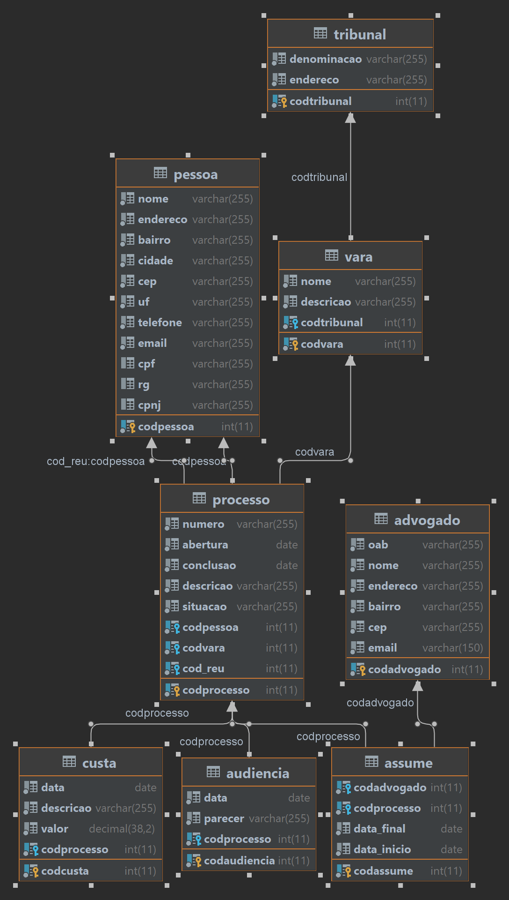

# lpoo-advocacia

> Projeto final da disciplina LPOO desenvolvido através da análise de um diagrama de classe UML utilizando o paradigma de orientação a objetos.

## 🧪 Tecnologias

- Java
- Spring Boot
- Mariadb

## Autor

<strong> Hamilton de Souza </strong>
 

